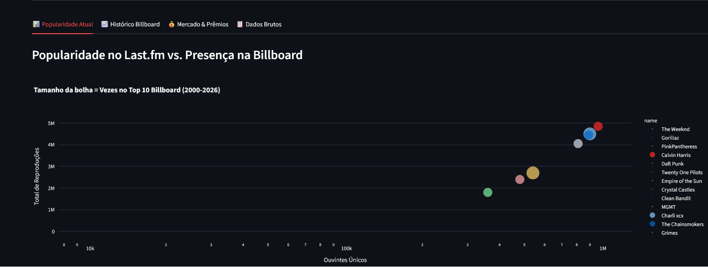
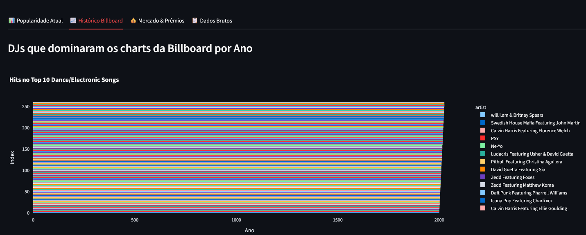
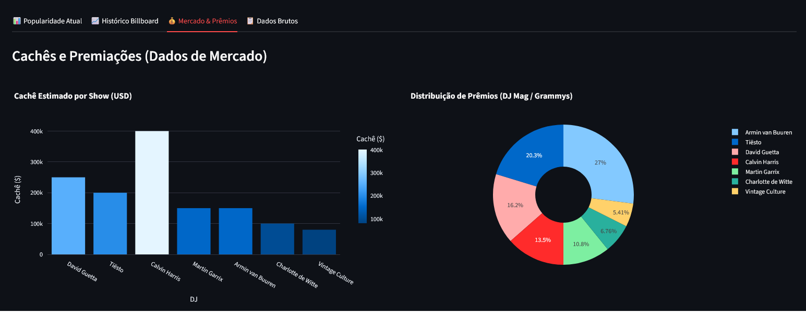

# 🎧 Electronic Music Data Pipeline

Este projeto é um pipeline de dados ponta a ponta que extrai tendências da música eletrônica global, cruza dados de popularidade atual com o histórico da Billboard (2000-2026) e apresenta os insights em um dashboard interativo.

## 🖼️ Visualização do Pipeline (Screenshots)

O dashboard foi construído para transformar dados brutos de APIs em inteligência de mercado. Abaixo, as principais funcionalidades:

### 1. Correlação: Popularidade vs. Histórico (Billboard)
Nesta visão, cruzamos o volume de ouvintes reais do Last.fm com o "peso" histórico do artista na Billboard (tamanho da bolha).
<p align="center">
  
</p>

### 2. Linha do Tempo: Dominância de Hits (2000-2026)
Análise de séries temporais mostrando quais DJs dominaram o Top 10 da Billboard ao longo das décadas.
<p align="center">
  
</p>

### 3. Métricas de Mercado e Camada Silver
Visualização dos dados processados, incluindo estimativas de cachês e a tabela final de dados brutos (Raw Data).
<p align="center">
  
</p>

## 🛠️ Tecnologias Utilizadas
* **Linguagem:** Python 3.10+
* **Extração:** Last.fm API, Billboard.py (Web Scraping)
* **Processamento:** Pandas (Limpeza, Normalização e Joins)
* **Dashboard:** Streamlit & Plotly
* **Ambiente:** Windows / VS Code

## 🏗️ Arquitetura do Pipeline
1. **Extract (`extract.py`):** Consome a API do Last.fm para buscar os Top 100 DJs de música eletrônica e utiliza scraping para buscar o Top 10 anual da Billboard desde o ano 2000.
2. **Transform (`transform.py`):** Realiza o *Data Matching* entre as fontes, trata valores nulos, padroniza nomes de artistas e cria métricas como "Billboard Legend" (DJs com múltiplas aparições históricas).
3. **Load/App (`app.py`):** Dashboard que permite filtrar DJs por volume de ouvintes e visualizar a dominância de gêneros ao longo das décadas.

## 🚀 Como Executar
1. Clone o repositório.
2. Crie um ambiente virtual: `python -m venv venv`.
3. Instale as dependências: `pip install -r requirements.txt`.
4. Adicione sua chave da API no arquivo `.env`: `LASTFM_API_KEY=sua_chave`.
5. Execute a extração e transformação:
   ```bash
   python extract.py
   python transform.py
